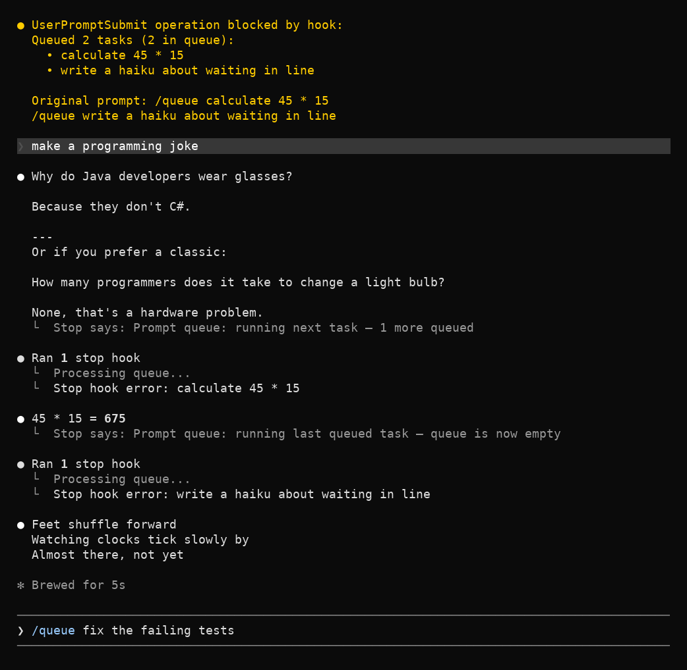

# claude-prompt-queue

Queue prompts in Claude Code. Type `/queue <prompt>` to queue tasks that auto-execute after the current one finishes.



## Install & Usage

Run each command separately — pasting the whole block at once submits it as a single command:

```
/plugin marketplace add DigitalCyberSoft/claude-prompt-queue
```

```
/plugin install prompt-queue@prompt-queue-marketplace
```

```
/reload-plugins
```

Then queue tasks:

```
/queue do this
```

If `/queue` reports "Unknown command" right after installing, start a new session once — the plugin registers the bare `/queue` name at session start (`/prompt-queue:queue` always works).

Queue several tasks in one message by putting each on its own `/queue` line (lines without the prefix are appended to the task above them):

```
/queue fix the login bug
/queue add tests for it
/queue update the changelog
```

- If Claude is idle, the first task starts right away; the rest run one per round after it
- `/queue` with no arguments lists the pending tasks
- Each time a queued task starts, a status line reports how many tasks are still queued

## How it works

- **SessionStart hook** — copies a `/queue` command stub to `~/.claude/commands/queue.md` so the bare `/queue` name resolves (unregistered slash commands are rejected before hooks run, and plugin commands only resolve as `/prompt-queue:queue`); also deletes stale queue files
- **UserPromptSubmit hook** — intercepts `/queue` messages, appends the tasks to a per-session queue file (tasks separated by an ASCII record-separator byte, so they can span lines), then lets the turn proceed with instructions to run the oldest pending task, so the queue starts draining immediately instead of waiting for an unrelated prompt to finish
- **Stop hook** — when Claude finishes a round, pops the next task from the queue, injects it, and reports how many remain
- The stub's body is only ever seen by Claude alongside the hook's instructions; if the hook failed to run (e.g. plugin disabled, `jq` missing), it tells you the prompt was not queued instead of executing it

## Tests

`bash tests/run-tests.sh` — exercises the hook scripts directly (queueing, FIFO order, multi-line and hostile content round-trips, status view, counts). Needs `python3`, used only by the tests to build and validate hook JSON. Runs in CI on every push.

## Limitations

- Queuing only works while Claude is idle (steering messages during processing bypass hooks)
- Queues are per session — tasks still queued when a session ends are not picked up by other sessions
- Chained prompts show as "Stop hook error" — cosmetic only, not an actual error
- Pasted images and large text pastes can't be queued — hooks only see the `[Image #1]` placeholder, not the attachment, so a queued task runs without it (you get a warning when this happens)
